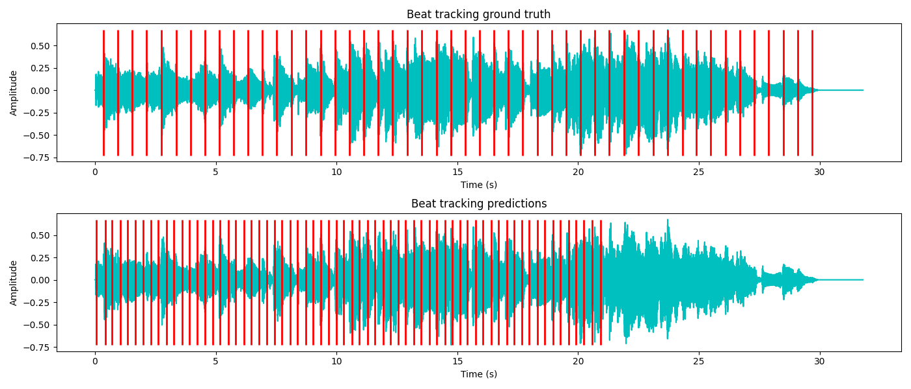

# Beat-Tracking with Neural Networks

Description
-----------

This project is part of the ECS7006 Music Informatics module at Queen Mary University of London.

The aim of this project is to detect the beat in the Ballroom Dataset <http://mtg.upf.edu/ismir2004/contest/tempoContest/node5.html> using Neural Networks. The label annotations for this dataset were derived by [Ballroom beat and bar annotations](https://github.com/CPJKU/BallroomAnnotations)

Run the code
-----------
Python version: `3.9`

Use this command:

```
python3 test_model.py
``` 

to test the code. Change the path for the pre-trained model `best_model.pth` to your local path. 

To train the model from scratch, use:

```
python3 train_model.py
```

Change the paths for the data to your local path.

Experiments
-----------

The architectures we experimented with were the following:

1. VGGish + MLP
2. CNN
3. VGGish + BLSTM
4. CNN + BLSTM

The 4th one is the most promising arcitecture out of all for this task.


Evaluation
-----------
The current results are not satisfactory. We are aiming to improve them in the future



References
------------
[1] Böck, Sebastian, and Markus Schedl. "Enhanced beat tracking with context
aware neural networks." Proc. Int. Conf. Digital Audio Effects. 2011.
14(5), pp.1832-1844, 2006.  
[2] MatthewDavies, E. P., and Sebastian Böck. "Temporal convolutional networks
for musical audio beat tracking." 2019 27th European Signal Processing
Conference (EUSIPCO). IEEE, 2019.  
[3] S. Hershey et al., "CNN architectures for large-scale audio classification,"
2017 IEEE International Conference on Acoustics, Speech and Signal
Processing (ICASSP), New Orleans, LA, USA, 2017, pp. 131-135, doi: 10.1109/
ICASSP.2017.7952132.